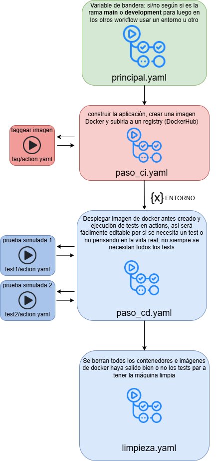

# Solución

## índice

- [Preparación previa](#preparación-previa)

- [Prueba en bruto (en un solo archivo)](#prueba-en-bruto-en-un-solo-archivo)

- [Versión final en varios workflows](#versión-final-en-varios-workflows)

- [Funcionamiento de rama development](#funcionamiento-de-rama-development)

- [Funcionamiento de rama main](#funcionamiento-de-rama-main)

- [Conclusiones](#conclusiones)
 
## preparación previa

Primero antes de nada, yo en otros ejercicios estaba siempre trabajando con la rama de `JavierGarciaExercises` y en este caso vamos a trabajar con la rama de `development` que es un requisito de una de las ramas que nos piden, asi mato 2 pajaros de un tiro


He creado una imagen para ver visualmente mi idea del ejercicio y como lo voy a plantear:


Antes comentar que todo esto lo hice en un runner propio, es sencillo de enlazar veamos cómo, nos vamos a `settings > runners > y le damos a añadir nuevo`


realizamos todos esos comandos en nuestra máquina virtual


Configuramos el runner


Y por último lo iniciamos con el siguiente comando (comando importante ya que si apagamos la máquina deberemos de volver a ejecutarlo, la configuración ya si está guardada)

```bash
./run.sh
```


**IMPORTANTE** si vamos a usar `docker` deberemos instalarlo antes en el `runner` de lo contrario no nos funcionará ya que no encontrará el comando, y con el usuario que ejecutemos el `run.sh` habrá que darle permisos metiendolo en el grupo de `docker` para que use el `docker engine` con el siguiente comando:

```bash
sudo usermod -aG docker $USER
```

Cerramos sesión y volvemos a iniciar para que se carguen los cambios

Probamos con un `workflow` básico para ver que usa el `runner`, dejaré el `workflow` comentado 


Vale pues así ya podemos usar nuestro propio `runner` así no uso horas de `ubuntu_latest`

Procedemos a generar el tocken de docker


Pongo el token y el nombre de usuario en variables, no de entorno, ya que son comunes para todos los environment 

## Prueba en bruto (en un solo archivo)

Primero voy a crear todo en un mismo archivo sin reutilizar ningun `workflow` esto lo hago para primero comprender el archivo más que nada

Vamos a ver nuestro `yaml` de `prueba_bruta.yaml` en el que simplemente probamos a subir una imagen en `docker` para ver su funcionamiento

```yaml
name: funcionamiento en bruto

on:
  workflow_dispatch:
    inputs:
      PRODUCCION:
        description: 'desplegar en producción (si/no)'
        required: true
        default: 'no'
      VERSION:
        description: 'versión de la imagen Docker'
        required: true
        default: '1'

#   push:
#     branches:
#       - main
#       - development

jobs:
  job-ci:
    runs-on: [weeklyjaviergarcia]
    steps:
      - name: Checkout del código
        uses: actions/checkout@v4
      - name: construir la imagen Docker
        run: |
          docker build -t ${{vars.DOCKERUSER}}/enbruto:${{ github.event.inputs.VERSION }} .

#https://github.com/docker/login-action

      - name: Login a Docker Hub
        uses: docker/login-action@v3
        with:
          username: ${{ vars.DOCKERUSER }}
          password: ${{ secrets.DOCKERTOKEN }}
      
      - name: Subir la imagen Docker a Docker Hub
        run: |
          docker push ${{vars.DOCKERUSER}}/enbruto:${{ github.event.inputs.VERSION }}

  job-cd:
    runs-on: [weeklyjaviergarcia]
    needs: job-ci
    steps:
      - name: Desplegar (simulado)
        run: |
          if [ "${{ github.event.inputs.PRODUCCION }}" == "si" ]; then
            echo "desplegando a Producción con la imagen ${{vars.DOCKERUSER}}/enbruto:${{ github.event.inputs.VERSION }}"
          else
            echo "desplegando a UAT con la imagen ${{vars.DOCKERUSER}}/enbruto:${{ github.event.inputs.VERSION }}"
          fi
```

Realmente aquí sólo hago la imagen, no compruebo que luego se pueda usar bien, eso lo voy a hacer manualmente una vez se suba, lo importante de este `yaml` sería la parte de `docker/login-action@v3` que es una action personalizada oficial de `docker` par loguearse de forma segura, así cuando termina el `workflow` borra la sesión para prevenir ataques. [aquí dejo la documentación](https://github.com/docker/login-action)

Probemos si crea bien la imagen, para ello debemos de ejecutar el `workflow` manualmente pues es `dispatch` con modo producción:


Vemos que se subió correctamente, por lo cual la parte de simular un despliegue salió bien


Veamos si se subió en `docker hub`


Por último como prueba final vamos a ver que pasa si arrancamos el contenedor con el comando:

```bash
docker run -p 8080:8080 javiergarciainformatico/enbruto:1
```


Bien! todo salio correcto, Ahora podremos probar con la versión completa de CI osea arrancando el contenedor y comprobando 2 tests que me he inventado para eso lo ponemos en modo `producción`


Vemos que me da un fallo en el test 2 es porque en el `html` está como `Luisk` con mayúsculas, este test lo dejare a propósito para cuando veamos el uso diferentes `workflows` se pueda ver un test fallido


Hay que tener en cuenta una cosa **MUY IMPORTANTE** y es que el contenedor si no lo paramos en el `workflow` seguirá en funcionamiento, y también sus imágenes descargadas.


esto hay que tenerlo muy en cuenta para borrar todo lo que queramos antes de que finalice el `workflow` o de lo contrario tendremos problemas en siguiente ejecuciones con el nombre del contenedor, las imagenes da un poco más de igual pero aún así también lo limpiaré, esto lo haremos en un `job` que dependa del de `cd` pero que de igual si ha fallado o no así se hará la limpieza necesaria si o si al finalizar el `workflow`

Lo conseguimos con estas líneas

```yaml
    needs: job-cd
    if: always() 
```

con `if: always()` ponemos que da igual si ha fallado el `needs` ya que por defecto si falla no se hace, forcé un error poniendo que exista ya el contenedor de `pruebas` así se ve el error real de por qué es necesaria la limpieza


## Versión final en varios workflows

Ahora empecemos con el `weekly` en si, antes sólo hemos estado entrenando un poco, ahora hay que separar todo lo que hemos realizado anteriormente en los pasos pertinentes antes explicados en el esquemita

Primero creamos 2 `environment` de desarrollo y de producción, y pongo nombres para lo que será el nombre del contenedor así veremos un uso real de los `environment`


Finalmente lo he partido en 4 `workflows` 1 principal 2 de los pasos `ci` `cd` y uno último de limpieza, pongo de nuevo mi planteamiento para que se vea más visualmente



Lo dividimos en estos 4 archivos:
[principal.yaml](../.github/workflows/principal.yaml) Me gusta definirlo como el padre de todos los `workflow` ya que se encarga de poner cada uno en funcionamiento cuando le toca y con los `input` y `output` necesarios

[paso_ci.yaml](../.github/workflows/paso_ci.yaml) Se encarga de la creación de la imagen de `docker` generando también su `tag` con el `action` de [tagger](../.github/actions/tag/action.yaml) y también de subir la imagen a nuestra cuenta de `docker hub`

[paso_cd.yaml](../.github/workflows/paso_cd.yaml) Se encarga de probar a descargarse la imagen del contenedor, ponerla en marcha y realizar diferentes test en ella según sea el `environment` usado serán `UAT` que las pongo simulando que fuesen manuales durante 5 segundos o de producción que hago 2 tests que los separo en `actions`, son tests para ver si la página web está funcionando bien y si es código 200

[limpieza.yaml](../.github/workflows/limpieza.yaml) Se encarga de borrar todas las imágenes y contenedores en funcionamiento para dejar el `runner` vacío para próximos despliegues, tengamos en cuenta que en un uso real se dejaría ya la aplicación de producción en funcionamiento y sólo se borraría la de pruebas, en este caso lo hice así para poder yo hacer pruebas continuamente sin tener que borrar manualmente los contenedores, destaco que si fuera un entorno de tests si sería inteligente borrarlo al final del todo siempre

Todo lo que hemos ido haciendo en la parte bruta lo he ido aplicando aquí, lo que hemos tenido que implementar ha sido el sistema para pasarse los `output`, hay que seguir el siguiente flujo para pasar `outputs` entre `workflows`


 y también la creación de variables de entorno de producción y desarrollo, vamos a ver todas las variables disponibles que tenemos


Hemos añadido la de `NOMBRE_ENVIRONMENT` que la uso según sea un entorno u otro para poner un nombre diferente al contenedor

Veamos todo el flujo en funcionamiento

### Funcionamiento de rama development

Vemos que tiene el siguiente aspecto:


Lo más importante es ver que los tests fueron sólo `UAT` no fueron los de producción

Vamos a ir viendo lo más importante de cada `workflow`

En el paso `ci` vemos cómo se crea el nombre de la imagen y se pasa al `output` para otros futuros `workflow`


En el paso `cd` se ve como arranca el contenedor y su prueba manual `UAT` que me inventé


La limpieza simplemente hacemos un `prune -f` y un `rm -f` para borrar imagenes y contenedores


### Funcionamiento de rama main


Antes, como hago un `pull request` pues borro la versión de la imagen de `docker` que se subió antes en `development` así no se pisará la versión con otra que ya existe en `docker hub`


Ahora si hago el `pull request` y se pondrá en funcionamiento el `workflow` de `principal.yaml`


Vayamos viendo las principales diferencias con respecto a la rama de `development`


La parte de `ci` es igual, lo que cambia es la parte de `cd` ya que primero usa la variable de entorno correspondiente es decir la de producción


Vemos que ha realizado los tests correctamente


Por último limpiamos, esto es igual a la otra rama.


## conclusiones

Ha sido un `weekly` muy disfrutable, me ha gustado por fin de una vez saber que era eso de `ci/cd` ya que lo escuchaba, sabía el concepto pero en la práctica no lo visualizaba, decir que ha sido un ejercicio en el cuál me he enfocado en primero entenderlo todo bien, tardé como 1 hora en hacerme mi croquis mental y plasmarlo en la foto del esquemita que diseñé, más prácticas asi porfavor he aprendido muchísimo


